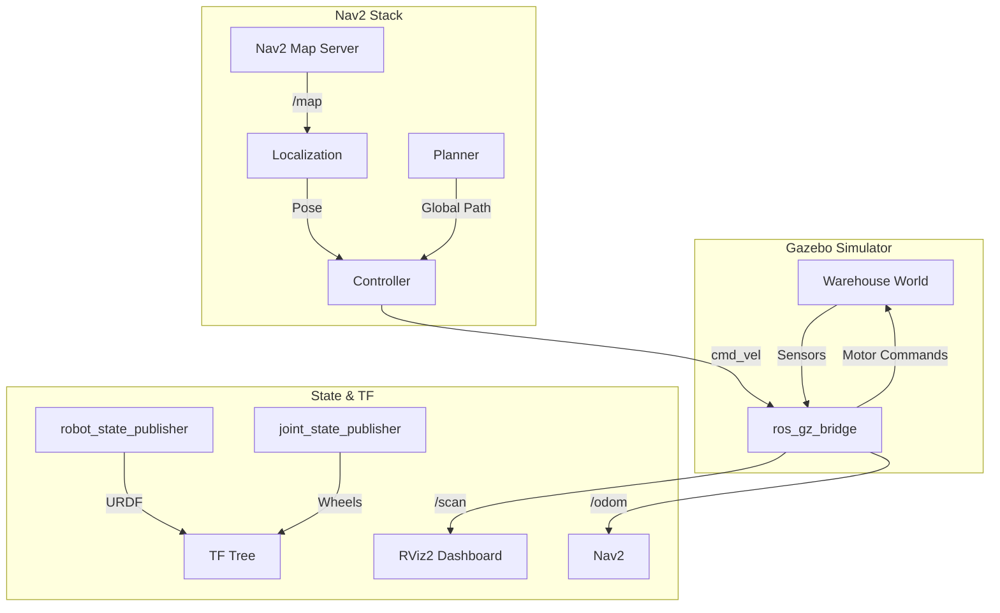

# 🤖 AI-Assisted Warehouse AMR Navigation System


> An autonomous mobile robot (AMR) simulation and control stack designed for warehouse environments. This project prioritizes production-quality software engineering practices over "hacky" demos, utilizing modular architecture, modern ROS 2 tooling, and lightweight simulation.

---

## 🎥 Autonomy in Action


---

## 🏗️ System Architecture

This project heavily utilizes the ROS 2 node graph. Below is a simplified representation of the data flow between our simulated hardware and the Nav2 brain:



---

## 🚀 Current Features (Phase 3 Completed)

* **Custom URDF Design:** Differential drive robot chassis with continuous wheel joints and integrated LiDAR (`laser_link`).
* **Simulation Environment:** Custom Gazebo walled warehouse world (`warehouse.sdf`) containing target obstacles and shelving.
* **2D Mapping:** Integrated `slam_toolbox` for dynamic environment mapping and `nav2_map_server` for static map generation.
* **Autonomous Navigation:** Full Nav2 bringup with pre-configured RViz dashboards, AMCL localization, and costmap generation for dynamic obstacle avoidance.

---

## 📂 Workspace Structure

A clean, production-ready ROS 2 package hierarchy:

```text
warehouse_amr_system/
├── config/                  # Bridge and parameters
├── maps/                    # SLAM generated occupancy grids
│   ├── warehouse_map.pgm
│   └── warehouse_map.yaml
├── src/
│   ├── warehouse_amr_bringup/       # Launch orchestrators
│   └── warehouse_amr_description/   # URDF/XACRO meshes
└── worlds/                  # Gazebo SDF environments
    └── warehouse.sdf

```

---

## 💻 Hardware Requirements

This simulation is optimized to run smoothly on standard development laptops without requiring heavy enterprise environments (e.g., NVIDIA Isaac Sim).

* **Recommended CPU:** Intel 12th Gen i5 (e.g., i5-12650H) or equivalent.
* **Recommended GPU:** Dedicated GPU (e.g., RTX 3050 Ti) for Gazebo rendering.
* **Memory:** 16GB RAM.

---

## ⚙️ Quick Start

**1. Build the workspace:**

```bash
colcon build --symlink-install

```

**2. Launch the Autonomous Stack (Requires 3 Terminals):**

```bash
# Terminal 1: Physics Engine
ros2 launch warehouse_amr_bringup sim.launch.py

# Terminal 2: Nav2 Brain
ros2 launch warehouse_amr_bringup nav.launch.py

# Terminal 3: Visualizer
ros2 run rviz2 rviz2 -d $(ros2 pkg prefix nav2_bringup)/share/nav2_bringup/rviz/nav2_default_view.rviz --ros-args -p use_sim_time:=true

```

---

## 🗺️ Roadmap

* [x] **Phase 1-3:** URDF, Gazebo Simulation, and Nav2 Autonomy.
* [ ] **Phase 4:** Fleet management and Nav2 autonomous task dispatching.
* [ ] **Phase 5:** CI/CD pipeline integration utilizing GitHub Actions, `ruff`/`black` for Python linting, and `clang-format` for C++.
* [ ] **Phase 6+:** Integration of an AI-assisted task allocation module utilizing `scikit-learn` or `XGBoost` for predictive routing and cost optimization.
